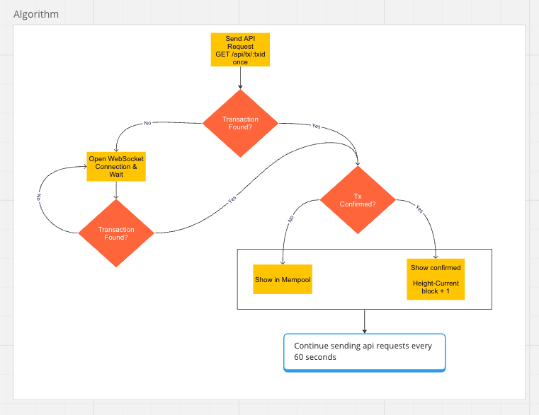

<h1 align="center">Bitcoin Transaction Tracker</h1>

<h3 align="center"> React Web App that provides real-time monitoring of Bitcoin transactions, displaying their current status and saving the final state to a Firestore database</h3>

<!-- TABLE OF CONTENTS -->
<details open>
  <summary>Table of Contents</summary>
  <ul>
    <li><a href="#about-the-project">About The Project</a></li>
    <li><a href="#tech-stack">Tech Stack</a></li>
    <li><a href="#prerequisites">Prerequisites</a></li>
    <li><a href="#how-to-use-in-dev">How to use in dev?</a></li>
    <li><a href="#algorithm">Algorithm</a></li>
  </ul>
</details>

## About The Project

This project was scaffolded with [Vite](https://vitejs.dev/).

## Tech Stack

[](https://react.dev/)
[](https://developer.mozilla.org/en-US/docs/Web/JavaScript)
[](https://vitejs.dev/)


## Prerequisites

Make sure to have NPM and Node installed.

## How To Use In Dev?

1. Clone the repo and navigate to `bitcoin-tx-tracker/`:
   ``` 
   cd /path/to/folder/bitcoin-tx-tracker/
   ```
2. Get dependencies:
   ``` 
   npm install
   ```
3. Fill in the env file with the .env.sample provided, with the firestore credentials
4. Run the app:
   ``` 
   npm run dev
   ```

## Algorithm

> A picture is worth a thousand words



Thank you!

